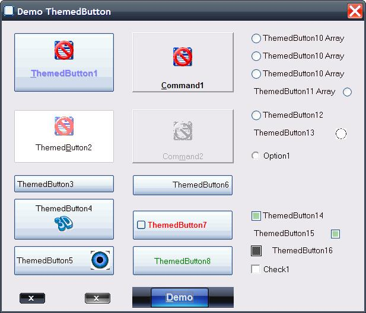



## ThemedButton

### Description

Add UseParentBackColor Property. What determines whether the parent background color can be used as background color. (Only if Windows is not themed or ButtonType is set as OptionButton or CheckBox!)"

Fixed some bugs for use the button with the arrowkeys and change some code so the functionality of the OptionButton and CheckBox more looks a like the default controls.

Add extra property for the Defaulted state of the user themed CommandButton and fixed bugs for the not themed windows OptionButton and CheckBox.

Change the default Value for the OptionButton and CheckBox to Unchecked, same as the VB-controls.

Some bugs for the OptionButton and CheckBox are fixed

Fixed some bugs, add OptionButton and CheckBox properties (the OptionButton can also be used in a multi selection array)

Add single corner roundings for User themed button and fixed some bugs.

Update, a little bugs are fixed and add properties so the user can customize the button.

Update, some bugs are fixed.

This is a Themed CommandButton control.

It takes the skin of the selected windows theme, also in Windows Vista.
 
### More Info
 

             |
---                |---
**Submitted On**   |2011-12-09 05:00:00
**By**             |[Ben Vonk](https://github.com/Planet-Source-Code/PSCIndex/blob/master/ByAuthor/ben-vonk.md)
**Level**          |Intermediate
**User Rating**    |5.0 (35 globes from 7 users)
**Compatibility**  |VB 6\.0
**Category**       |[Custom Controls/ Forms/  Menus](https://github.com/Planet-Source-Code/PSCIndex/blob/master/ByCategory/custom-controls-forms-menus__1-4.md)
**World**          |[Visual Basic](https://github.com/Planet-Source-Code/PSCIndex/blob/master/ByWorld/visual-basic.md)
**Archive File**   |[ThemedButt2220742262012\.zip](https://github.com/Planet-Source-Code/ben-vonk-themedbutton__1-71237/archive/master.zip)

